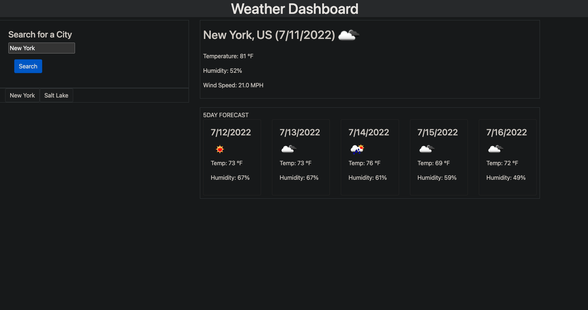

# Weather Dashboard

## Description

This is a weather platform that will let you search for what the weather is based on the city. It will then pull up a 5 day forecast of that area as well as other meteorological data.

## Table of Contents

- [Installation](#installation)
- [Usage](#usage)
- [Function](#function)
- [Credits](#credits)
- [License](#license)

## Installation

You can install this by opening up the page on GitHub and cloning it to your computer using bash or terminal. Once cloned it can be opened up on VS Code.

Please see video link for a walk through on how to clone it.

[Clone to your computer](https://drive.google.com/file/d/15ogCY3Q-JLWhteoSiIoXLkhtK4Z0-mfz/view?usp=sharing "Click Me!")
  

You can install this by cloning it to your computer.

## Usage

Put a city name in the search bar and discover what the weather is for that city.

## Credits

## License

---

## Contact Me

jamesfillerup9@gmail.com

